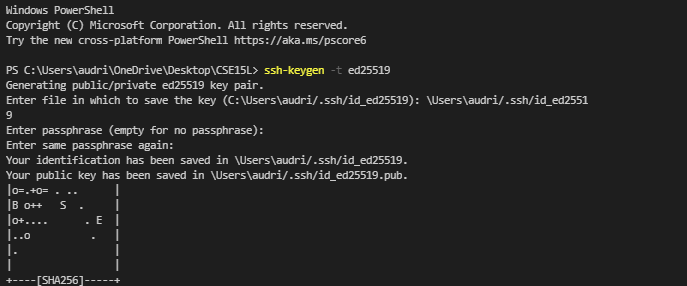

<h1 align="center"> <mark style="background-color: #7fb81d ; color: white; font-size: 30px; font-family:Courier;"> <b>  👩🏾‍💻How To Log Into a Course-Specific Account on ieng6 </b> </mark> </h1>


<h1 align="center"> Installing VScode </h1>

* Go to [Visual Code](https://code.visualstudio.com/)  
* Click the downward arrow in the blue box and choose the operating system you have:
  * macOS
  * Windows
  * Linux  
  
    
  * open 
  

* Agree with the Licence Terms   
> VScode aloows us to connect to a remote server which we will see below


      


 <h1 align="center"> Remotely Connecting</h1>

<mark style="background-color: yellow">

* Extra Step for Window users: We will Install Open SSH via the settings within your laptop/computer
   * Click the windows logo at the bottom left of your screen. 
   * Then click "Settings" it's the second to last button on the sidebar 

     

   * On the left side click on "Apps"

   

   *  "Apps & Features" pops up. Click "Optional Features" 

   

   * Install OpenSSH Client and openSSH Server
     * First check if already installed by typing the names in "Installed Featues" 
     * If not found, proceed to "Optional Features" and type in each feature's name one at a time. Click install 

      

> For further information check out [this website](https://docs.microsoft.com/en-us/windows-server/administration/openssh/openssh_install_firstuse)


</mark>


* Loook Up course-specific account [here](https://sdacs.ucsd.edu/~icc/index.php)


  * Login with your UCSD info
  * You will have to change your password and wait about 15 minutes to let it "Activate" 
  * Look under **Additional Accounts** to your corresponding class the grayish block is important and personal to you  


 > The last **three** letters are for you specifically, don't forget it when typing in terminal @ VSCode  
* Open VScode and click terminal-->New Terminal  
* In the terminal enter your course-specific account, which we found two steps ago  
  * If it's your first time login in, it will ask you if you want to continue. In which you say yes  
  * Type your password
  > It will be invisible for your protection

  


 <h1 align="center">Trying Some Commands</h1>

* Try the following commands  on *your* computer (without being in your course-specific account) and on the *remote* computer
 > For **remote** computer make sure you start your command with 👉🏾**ssh**👈🏾  
  * cd ..  
  * dir
  * cd <file name> 
  * exit
  * clear
  > These commands help you move from one folder to the sub folder to the sub-sub folders.etc

  
|*Your* Computer            | *Remote* Computer                                |
| ------------------------- | ------------------------------------------------ |
|| |

 
 <h1 align="center">Moving Files with scp</h1>

 > Think of it like when you need access to a picture yout took of your receipt but now you want to access that picture from another device so you email yourslef because you can log in to email anywhere with any device as long as you have the password to that device 💻

 * Create a file <NameOfFile.java> with the follOwing content on *your* computer (thus  ❌ieng6 , but ✅powershell on terminal):
 > to create a file you need to first open/create a folder 
 
``` java

class NameOfFile {
  public static void main(String[] args) {
    System.out.println(System.getProperty("os.name"));
    System.out.println(System.getProperty("user.name"));
    System.out.println(System.getProperty("user.home"));
    System.out.println(System.getProperty("user.dir"));
  }
}

 ```

* Run: ```javac``` and ```java```


* In same terminal type following command:
```
scp NameOfFile.java cs15lwi22zz@ieng6.ucsd.edu:~/

```


> **Note**: the start of the command is scp  s-c-p not ssh s-s-h, but it will give the same step of asking for the password.
> p.s you just copy pasted the file from A to B computer 


* Now, go *into* **ssh** 
``` ssh cs15lwi22zzz@ieng6.ucsd.edu```
* type command ``` ls  ```
* and uuuuu there it is, the file you copied 
* *Now* run file on *remote* computer ```javac``` and  ```java```
> This is like accepting it and making it official on the *remote* computer


  

<h1 align="center">Setting an SSH Key</h1>

when trying to get access to our *remote* computer we have to enter the password each time. So we can use ```ssh-keygen``` to make a **public** key (on server *remote* computer) and **private** key (client, *your* computer)

> File with the ending ```.pub``` are public whereas those that don't have that are private 

> So file ``` id_rsa``` contains the private  key and ```id_rsa.pub``` contains the public key which istored is ```.ssh```

* On *client* computer type the following command

``` ssh-keygen -t ed25519
```

* Then it will ask you to enter file you can either just type "enter" or can insert the  path as in ```/Users/audri/.ssh/id_rsa.pub```

* Enter passphrase of choice




* Extra Step for Windows users ```ssha-add``
  * with ```ssh-add``` user private key will be stored 

<h1 align="center"> Optimizing Remote Running</h1>
### Already Centered?     

 
___
> Tip: 
* 


* <mark>    highlihgt    </mark>

<mark style="background-color: #FF0BAC ">uu me</mark>  
<mark style="background-color: #B4F8C8 ">uu me</mark>

<span style="color: white;">text</span> 

* Code below

           
            # Hello World
            java
            cs
            c++
            hii
yeah im out 
        
        hi

well  
hello


checklist uuuu  


``` javascript
 int s = 20;
String Chicken = "Chicken Niggets";
 Array Cheese [] = new Array [10];

```


