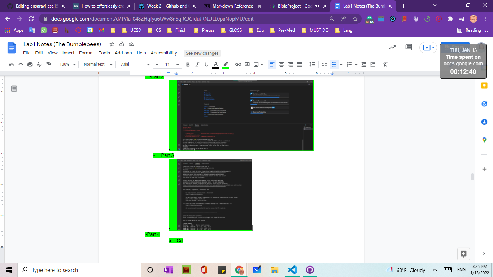

___
# Tittle 1 <br>
****
> Tip: 
* 

* <mark>    highlihgt    </mark>

<mark style="background-color: #FF0BAC ">uu me</mark>  
<mark style="background-color: #B4F8C8 ">uu me</mark>

* Code below

           
            # Hello World
            java
            cs
            c++
            hii
yeah im out 
        
        hi

well  
hello


checklist uuuu  


``` javascript
 int s = 20;
String Chicken = "Chicken Niggets";
 Array Cheese [] = new Array [10];

```


