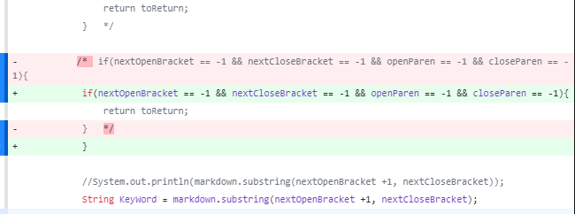
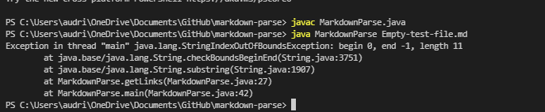
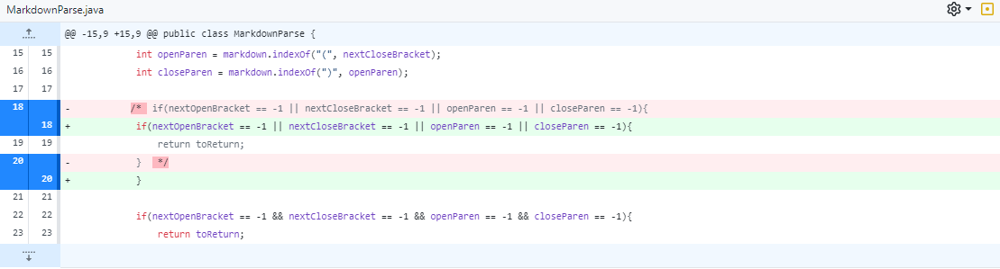
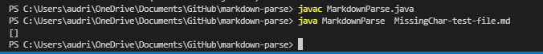

<h1 align="center"> <mark style="background-color: #7fb81d ; color: white; font-size: 30px; font-family:Courier;"> <b> Change 1: Empty Array showing up us Empty [] </b> </mark> </h1>

## 📸Picture of code change: 
  
I forgot to save take a picture of when I commited the change at the beginning but the change was adding 

```

if(nextOpenBracket == -1 && nextCloseBracket == -1 && openParen == -1 && closeParen == -1){
     return toReturn;
}   
```
 
 
## 🔗Link to Test file for *failure-inducing input* 
[Test File: Empty Array](https://github.com/ansarav/markdown-parse/blob/8e4f3b942398ade970ef879c25437bec2c30cc13/Empty-test-file.md)


## 🤪Symptom (*commit history/ terminal* )
  

## 2-3 Sentences: Relationship between ❤bug💔Symptom💖Failure Induced Input
The symptom was that the program had an output IndexOutOfBounds Exception due to the while loop requiring atleast one index to be able to identify substring. But because we had nothing at all in the test file (Empty) this failure induced Input although simple, allows us to see that the test codes are crucial to fill an array. With this information we allow an array to be created even with 0 elements created 


<h1 align="center"> <mark style="background-color: #7fb81d ; color: white; font-size: 30px; font-family:Courier;"> <b> Change 2: Links Missing Characters ), (, [,] </b> </mark> </h1>


## 📸Picture of code change: 


```
if(nextOpenBracket == -1 || nextCloseBracket == -1 || openParen == -1 || closeParen == -1){
                return toReturn;
            } 
```
 
## 🔗Link to Test file for *failure-inducing input* 
[Test File: MissingChar ")"](https://github.com/ansarav/markdown-parse/blob/9d11a96f9f99001a15a5191b1ca093210a74b74a/MissingChar-test-file.md)


## 🤪Symptom (*commit history/ terminal* )
   
 

 vs Fixed👇🏾


 

## 2-3 Sentences: Relationship between ❤bug💔Symptom💖Failure Induced Input
The Failure Induced Input `[words](hmmm` pointed out that the code required the computer to consider incomplete link syntax as not an element, but there will still have to be an Array [] output at the very least. The IndexOutBoundExeption was a symptom of the bug found inside the while loop where there was only consideration for complete link syntax.


<h1 align="center"> <mark style="background-color: #7fb81d ; color: white; font-size: 30px; font-family:Courier;"> <b> Change 3: Only adding Links that are "valid" </b> </mark> </h1>
## 📸Picture of code change: 


 
 
## 🔗Link to Test file for *failure-inducing input* 
[Test File: Remove Entry with "NotYet" inside []](https://github.com/ansarav/markdown-parse/blob/ad55c1e455ace2ae06aa713e39992ae7df71728e/MaybeLink.md)


## 🤪Symptom (*commit history/ terminal* )
 


## 2-3 Sentences: Relationship between ❤bug💔Symptom💖Failure Induced Input

> My fault for coding "==" instead of ".equal" when checking the if condition of the link having "NotYet" inside the bracket, was the bug. This bug was made aware to us by the Symptom of not providing the correct output( the body of the if statement did not work despite meeting the condition). The failure Induced Input was ```[NotYet]( DoNotAddThisLink.com)``` the code failed, we knew th bug was near the most recently edited portions. 