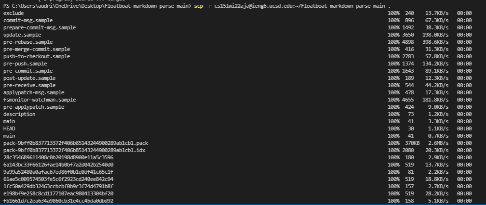
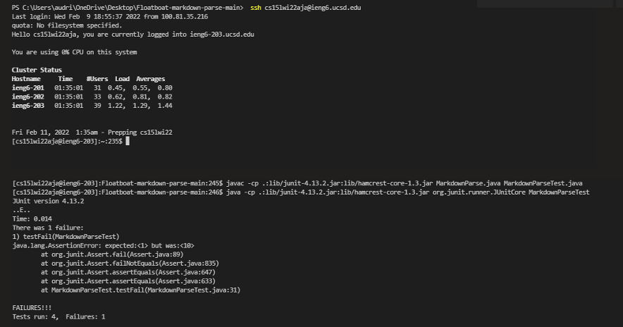
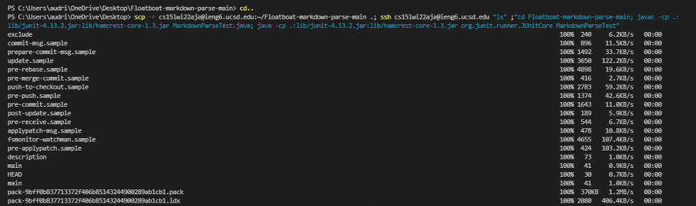

<h1 align="center"> <mark style="background-color: #7fb81d ; color: white; font-size: 30px; font-family:Courier;"> <b>  👩🏾‍💻How To Copy Whole Directories with scp -r </b> </mark> </h1>
 
 <br>

# 🎇Start: Copying Whole Markdown-parse Directory to Your ieng6 Account
 

After ``scp -r.`` goes the location of where you want to copy directory and afterwards is what directory you want to copy. SO the name of the direcotry will do. the  period is specifically for the code to recognize you are trying to copy a dire

ctory


# 🎇Next: Logging into your ieng6 account & compiling and running the tests for your repository 
 


 Now we log inot our remote account by using ```ssh ``` from there we compile with the follwing command lines:

 ``` javac -cp .:lib/junit-4.13.2 .jar:lib/hamcrest-core-1.3.jar MarkdownParse.java MarkdownParseTest.java ```


 we run with: 

 ```java -cp .:lib/junit-4.13.2.jar:lib/hamcrest-core-1.3.jar org.junit.runner.JUnitCore MarkdownParseTest ```


# 🎇Finish: Combining scp, ; , and ssh   
 
 
 > **Purpose** : To copy the whole directory and run the tests in one line.


This one line command is helpful because we can use up arrow to reduce keystroke and to copy,compil, and run all in one line of code

