<h1 align="center"> <mark style="background-color: #7fb81d ; color: white; font-size: 30px; font-family:Courier;"> <b>.                              .               .               Adding Tests               .               .                              .</b> </mark> </h1>
 


😎All 6 outputs were done via VScode preview😎

[My markdown-parse repository]( https://github.com/ansarav/markdown-parse)  

[The one reviewed week 7]( https://github.com/Alexander-Kourjanski/markdown-parse/blob/main/MarkdownParseTest.java) 


 <h1 align="center"> Snippet 1 </h1>

 ```
 `[a link`](url.com)

[another link](`google.com)`

[`cod[e`](google.com)

[`code]`](ucsd.edu)
 ```
  >  It *should* produce:  
    ``` 'google.com```  
    ```google.com```  
    ```ucsd.edu ```


 * Test 1: 
   
    > Show code in MarkdownParseTest.java for how you turned it into a __test__

    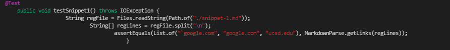

    > Corresponding __output__: not passed
    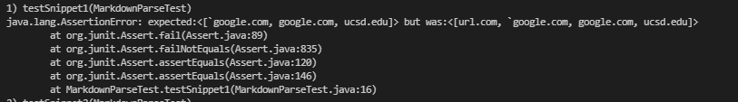

    
    
 * Test 2: Implementation  reviewed week 7

    > Show code in MarkdownParseTest.java for how you turned it into a __test__
   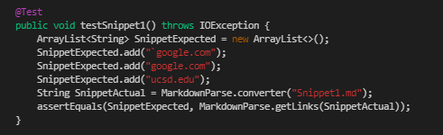

    > Corresponding __output__: not passed
   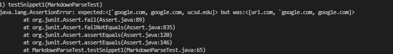
    
 <h1 align="center"> Snippet 2 </h1>

 ```
 [a [nested link](a.com)](b.com)

[a nested parenthesized url](a.com(()))

[some escaped \[ brackets \]](example.com)
 ```
 >  It *should* produce:  
    ```a.com, a.com(())```  
    ```example.com```  


  * Test 3: 
   
    > Show code in MarkdownParseTest.java for how you turned it into a __test__

    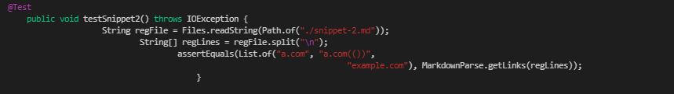

    > Corresponding __output__: not passed
    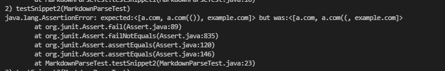

    
    
 * Test 4: Implementation  reviewed week 7

    > Show code in MarkdownParseTest.java for how you turned it into a __test__
   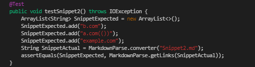

    > Corresponding __output__: not passed
   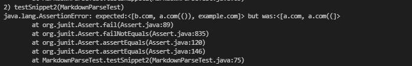 
 
 <h1 align="center"> Snippet 3 </h1>

 
 ```
  [this title text is really long and takes up more than 
one line

and has some line breaks](
    https://www.twitter.com
)

[this title text is really long and takes up more than 
one line](
    https://ucsd-cse15l-w22.github.io/
)


[this link doesn't have a closing parenthesis](github.com

And there's still some more text after that.

[this link doesn't have a closing parenthesis for a while](https://cse.ucsd.edu/


)

And then there's more text
 ```

 >  It *should* produce:  
    ```https://www.twitter.com```  
    ```https://ucsd-cse15l-w22.github.io/```  
    ```https://cse.ucsd.edu/```

  * Test 5: 
   
    > Show code in MarkdownParseTest.java for how you turned it into a __test__

    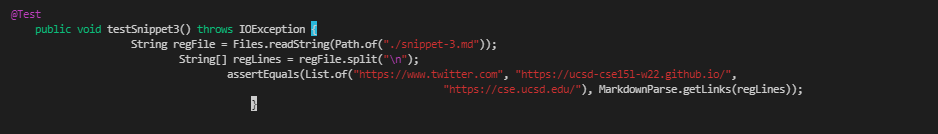

    > Corresponding __output__: not passed
    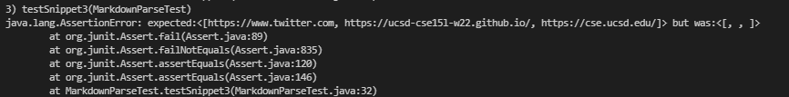

    
    
 * Test 6: Implementation  reviewed week 7

    > Show code in MarkdownParseTest.java for how you turned it into a __test__
   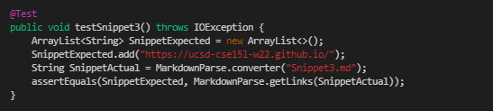

    > Corresponding __output__: not passed
   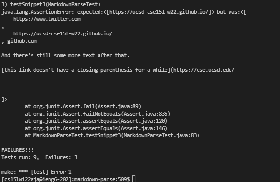


<h1 align="center">Questions </h1>

### 1) Do you think there is a small (<10 lines) code change that will make your program work for snippet 1 and all related cases that use inline code with backticks? If yes, describe the code change. If not, describe why it would be a more involved change.

>  Ans:  Yup because the problem/ bug here is that it looking for the first character to be  an open bracket, but ther would be cases sucha s the first line in snippet 1 where ther can be other character before the open bracket. So distinguishing an open bracket as the start of the potential link should be more spcific such as when the the open bracket has a space before it. This will just take fewer than 10 lines. If anything we can add an if statment such as if "[" has a character attached to the front of it, exit the commands of adressing it as a link.


### 2)Do you think there is a small (<10 lines) code change that will make your program work for snippet 2 and all related cases that nest parentheses, brackets, and escaped brackets? If yes, describe the code change. If not, describe why it would be a more involved change.

> Ans: I think this one will take more than 10 lines because we need to add a Counter as in like an instance variable where the code is able to match chracters to their even number of appearance based on its update number. So when x =2 or x=6 it will count the characters within as part of the bracket unit or paranthesis unit. As in () and (()) is a pair within a pair and (( ) or ( )) will only consider what is inside the most outer and inner paranthesis  and brackets as part of that ONE pair. 

### 3) Do you think there is a small (<10 lines) code change that will make your program work for snippet 3 and all related cases that have newlines in brackets and parentheses? If yes, describe the code change. If not, describe why it would be a more involved change.

> Ans: I think this will take less than 10 lines of code because it will just need to recognize to current condition to the character after the newline and thus continue its search for it's matching closed parenthsis or closed bracket depending with respect to the unmatched "(" or "[" the test file has. It's just moveing the or updating the current index or "recursor". 