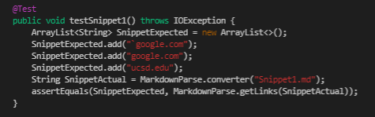
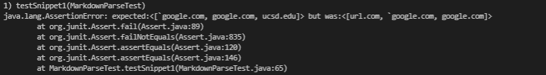
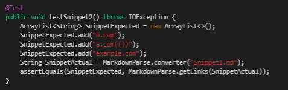
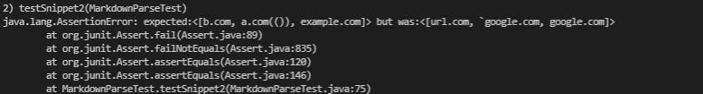
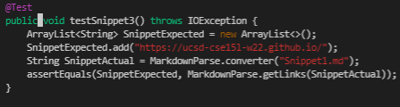
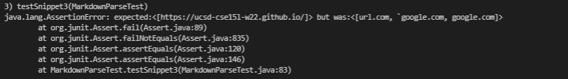

<h1 align="center"> <mark style="background-color: #7fb81d ; color: white; font-size: 30px; font-family:Courier;"> <b>.                              .               .               Adding Tests               .               .                              .</b> </mark> </h1>
 
 


😎All 6 outputs were done via VScode preview😎

[My markdown-parse repository]( https://github.com/ansarav/markdown-parse)  

[The one reviewed week 7]( https://github.com/Alexander-Kourjanski/markdown-parse/blob/main/MarkdownParseTest.java) 


 <h1 align="center"> Snippet 1 </h1>

 ```
 `[a link`](url.com)

[another link](`google.com)`

[`cod[e`](google.com)

[`code]`](ucsd.edu)
 ```
  >  It *should* produce:  
    ```google.com```  
    ```google.com```  
    ```ucsd.edu ```


 * Test 1: 
   
    > Show code in MarkdownParseTest.java for how you turned it into a __test__

    

    > Corresponding __output__: not passed
    

    
    
 * Test 2: Implementation  reviewed week 7

    > Show code in MarkdownParseTest.java for how you turned it into a __test__
   

    > Corresponding __output__: not passed
   
    
 <h1 align="center"> Snippet 2 </h1>

 ```
 [a [nested link](a.com)](b.com)

[a nested parenthesized url](a.com(()))

[some escaped \[ brackets \]](example.com)
 ```


  * Test 3: 
   
    > Show code in MarkdownParseTest.java for how you turned it into a __test__

    

    > Corresponding __output__: not passed
    

    
    
 * Test 4: Implementation  reviewed week 7

    > Show code in MarkdownParseTest.java for how you turned it into a __test__
   

    > Corresponding __output__: not passed
    
 
 <h1 align="center"> Snippet 3 </h1>

 
 ```
  [this title text is really long and takes up more than 
one line

and has some line breaks](
    https://www.twitter.com
)

[this title text is really long and takes up more than 
one line](
    https://ucsd-cse15l-w22.github.io/
)


[this link doesn't have a closing parenthesis](github.com

And there's still some more text after that.

[this link doesn't have a closing parenthesis for a while](https://cse.ucsd.edu/


)

And then there's more text
 ```


  * Test 5: 
   
    > Show code in MarkdownParseTest.java for how you turned it into a __test__

    

    > Corresponding __output__: not passed
    

    
    
 * Test 6: Implementation  reviewed week 7

    > Show code in MarkdownParseTest.java for how you turned it into a __test__
   

    > Corresponding __output__: not passed
   


<h1 align="center">Questions </h1>

### 1) Do you think there is a small (<10 lines) code change that will make your program work for snippet 1 and all related cases that use inline code with backticks? If yes, describe the code change. If not, describe why it would be a more involved change.

>  Ans: 


### 2)Do you think there is a small (<10 lines) code change that will make your program work for snippet 2 and all related cases that nest parentheses, brackets, and escaped brackets? If yes, describe the code change. If not, describe why it would be a more involved change.

> Ans: 

### 3) Do you think there is a small (<10 lines) code change that will make your program work for snippet 3 and all related cases that have newlines in brackets and parentheses? If yes, describe the code change. If not, describe why it would be a more involved change.

> Ans: 